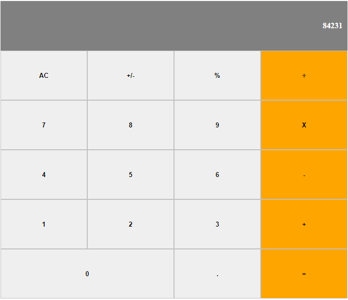

# React Calculator

A beauty and simple calculator built with React.js

## Screenshot



## Getting Started

Clone the repository into your local computer

### Installing

First, you'll have to install the newest version of [Node](https://nodejs.org/en/download/). Otherwise, the npx command could not be available. Then move into the project main directory on the console and follow the instructions below

Install all packages:

```
$ npm install
```

Run Local WebServer:

```
$ npm start
```

Now open the `http://localhost:3000/` in the browser

## Ideas for improvement

- Accept keyboard input
- Add scientific calculator options
- Make the design responsive

## Built With

* [JavaScript](https://www.javascript.com/) - Programming language used
* [React](https://reactjs.org/docs/getting-started.html) - Framework used
* [HTML](https://en.wikipedia.org/wiki/HTML) - Hypertext Markup Language
* [CSS](https://www.w3.org/Style/CSS/Overview.en.html) - Cascading Style Sheets
* [VS Code](https://code.visualstudio.com/) - The code editor used 

## Author

👤 **Vinicius Campos Carvalho**

<a href="https://github.com/kazumaki" rel="noopener noreferrer" target="_blank">

   

</a>

- Github: [@kazumaki](https://github.com/kazumaki)
- Twitter: [@iKazumaki](https://twitter.com/iKazumaki)
- Linkedin: [Vinicius Campos Carvalho](https://www.linkedin.com/in/vcamposcarvalho/)
- Email: [vcampos.pitangui@gmail.com](vcampos.pitangui@gmail.com)

## License

This project is licensed under the MIT License - see the [LICENSE](LICENSE) file for details
